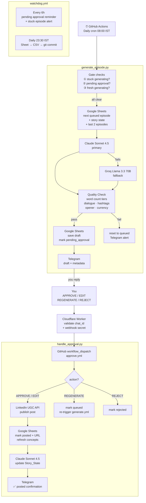

# Arjun's Money Diaries — Automated LinkedIn Content Engine


A fully automated LinkedIn content pipeline for a serialised personal finance series. AI generates each episode, a quality gate validates it, you approve from Telegram with one word — it posts to LinkedIn and queues the next episode. Runs indefinitely at ~$2-4/month.

**Live series** → [alok-munshi-portfolio.vercel.app/money-diaries](https://alok-munshi-portfolio.vercel.app/money-diaries)

> 44-episode serialised series · Fully automated · $0 infrastructure cost · ~$2-4/month Claude API · Built and operated by one person

---

## By the numbers

| | |
|---|---|
| Episodes planned | 44 (Season 1) |
| Episodes posted | 4 (and counting) |
| Workflows | 4 GitHub Actions workflows |
| Python modules | 9 (generation, approval, QC, sheets, LLM, prompts, comms, watchdog, backup) |
| LLM providers | 2 (Claude Sonnet 4.5 primary + Groq Llama 3.3 70B fallback) |
| Infrastructure cost | $0/month |
| Total operating cost | ~$2-4/month (Claude API only) |
| Human touchpoints | 1 per episode (Telegram approval) |
| Failure modes fixed | 8 silent failure modes identified and resolved |
| Backup frequency | Daily — full Sheet → CSV → git commit |
| Monitoring | 6-hourly watchdog + stuck episode detection |
| Token rotation | Every 60 days (LinkedIn) |

---

## How it works

1. **Generates** — GitHub Actions cron triggers daily. Checks for stuck/pending episodes before proceeding. Picks the next queued episode from Google Sheets, builds a structured prompt with story continuity and character state, calls Claude Sonnet 4.5 (Groq Llama 3.3 70B as automatic fallback). Runs a tiered quality check: word count bands, dialogue presence, correct opener, hashtags, teaser line, currency symbol validation.
2. **Delivers** — Sends the draft to Telegram with full metadata: title, hook, concept, character, word count, QC label and warnings.
3. **Approves** — You reply with one word: `APPROVE`, `EDIT: [your version]`, `REGENERATE`, or `REJECT`. A Cloudflare Worker receives the message, validates it, and triggers the approval workflow on GitHub.
4. **Posts** — Approved text posts to LinkedIn via UGC API. Sheet updates to `posted`. Concepts string refreshes across all queued episodes. Story state updates via a second LLM call to maintain character continuity.
5. **Monitors** — 6-hourly watchdog reminds you of pending approvals and alerts on stuck generating episodes. Daily backup commits the full Sheet as CSV to git.

---

## Architecture



---

## Stack

| Layer | Tool |
|---|---|
| Orchestration | GitHub Actions (4 workflows) |
| AI generation — primary | Claude Sonnet 4.5 |
| AI generation — fallback | Groq Llama 3.3 70B |
| Webhook bridge | Cloudflare Workers |
| Approval channel | Telegram Bot API |
| Publishing | LinkedIn UGC API |
| Data store | Google Sheets |
| Secrets | GitHub Actions Secrets + Cloudflare Worker Secrets |
| Backups | Git (daily CSV snapshots) |
| Monthly cost | ~$2-4 (Claude API only, everything else free) |

---

## Repo structure

```
.github/workflows/
  generate.yml       # daily cron — gate checks + generate next episode
  approve.yml        # triggered by Cloudflare Worker on Telegram reply
  watchdog.yml       # pending approval reminders + stuck episode alerts
  backup.yml         # daily Sheet → CSV → git commit

scripts/
  generate_episode.py   # main generation orchestrator + gate logic
  handle_approval.py    # approval routing (approve/edit/regen/reject)
  watchdog.py           # reminder + stuck episode monitoring
  backup_sheet.py       # Sheet → CSV dump
  prompts.py            # system prompt + user prompt assembly
  llm.py                # Claude + Groq client with automatic fallback
  qc.py                 # tiered quality check gate
  sheets.py             # Google Sheets read/write layer (singleton client)
  comms.py              # Telegram + LinkedIn API wrappers

cloudflare-worker/
  src/index.js       # Telegram webhook → GitHub workflow_dispatch bridge

backups/
  sheets/            # Episodes.csv + Story_State.csv (auto-committed daily)

docs/
  RUNBOOK.md               # ongoing operations guide
  RISKS.md                 # failure modes and mitigations
  COST_ANALYSIS.md         # cost breakdown
  TESTING_AND_ROLLBACK.md  # testing and rollback procedures
  MIGRATION.md             # original n8n → GitHub Actions migration notes
```

---

## Quality gate — word count tiers

Every generated episode passes through a tiered QC gate before being sent for approval:

| Word count | Result |
|---|---|
| Below 200 | ❌ Hard fail — reset to queued |
| 200–219 | 🚨 Alert + pass |
| 220–239 | ⚠️ Warning + pass |
| 240–300 | ✅ Ideal range |
| 301–319 | ⚠️ Warning + pass |
| 320–339 | 🚨 Alert + pass |
| 340+ | ❌ Hard fail — reset to queued |

Additional checks: correct episode opener, dialogue presence, hashtags, teaser line, rupee symbol (₹ not $ or Rs.), no non-Indian financial instruments.

---

## Generation gate — prevents double posts

Before generating, the system checks in order:

1. Any episode stuck at `generating` > 15 min? → alert + stop
2. Any episode at `pending_approval`? → silent skip (already waiting for you)
3. Any episode currently `generating`? → silent skip (run in progress)
4. All clear → pick next queued episode → generate

This ensures the cron fires daily but only generates when you are actually ready — respecting the 2-day posting cadence.

---

## Approval commands

| Command | What happens |
|---|---|
| `APPROVE` | Posts draft as-is to LinkedIn |
| `EDIT: [full text]` | Posts your edited version |
| `REGENERATE` | Discards draft, generates a fresh one immediately |
| `REJECT` | Marks episode rejected, moves to next |

---

## Want to run this for your own series?

### Prerequisites

- GitHub account (free)
- Anthropic account (Claude API — ~$2-4/month at 1 episode/day)
- Groq account (free — fallback only)
- Cloudflare account (free)
- Telegram bot (via @BotFather)
- LinkedIn developer app (for UGC posting)

### Setup in 8 steps

**1. Fork this repo**

**2. Create a Google Sheet** with two tabs: `Episodes` and `Story_State`. See `backups/sheets/Episodes.csv` for the exact column schema. Add `Generated_At` as the last column in the Episodes tab.

**3. Create a Google service account**

- console.cloud.google.com → IAM → Service Accounts → Create
- Download the JSON key
- Share your Sheet with the service account email (Editor access)
- Enable the Google Sheets API on the project

**4. Get your API keys**

- Claude: https://console.anthropic.com/keys
- Groq: https://console.groq.com/keys

**5. Add GitHub Secrets** (Settings → Secrets → Actions):

| Secret | Value |
|---|---|
| `ANTHROPIC_API_KEY` | from step 4 |
| `GROQ_API_KEY` | from step 4 |
| `GOOGLE_SERVICE_ACCOUNT_JSON` | full JSON file contents |
| `SHEET_ID` | your Sheet ID from the URL |
| `TELEGRAM_BOT_TOKEN` | your bot token |
| `TELEGRAM_CHAT_ID` | your numeric chat ID |
| `LINKEDIN_ACCESS_TOKEN` | from LinkedIn developer app |
| `LINKEDIN_PERSON_URN` | `urn:li:person:YOUR_ID` |
| `EPISODES_PORTFOLIO_URL` | your public episodes page URL |

**6. Deploy the Cloudflare Worker**

```
cd cloudflare-worker
npm install -g wrangler
wrangler login
wrangler deploy
wrangler secret put TELEGRAM_BOT_TOKEN
wrangler secret put TELEGRAM_WEBHOOK_SECRET
wrangler secret put GITHUB_TOKEN
wrangler secret put AUTHORIZED_CHAT_ID
wrangler secret put GITHUB_OWNER
wrangler secret put GITHUB_REPO
```

**7. Point Telegram webhook at the Worker**

```
curl -X POST "https://api.telegram.org/bot<TOKEN>/setWebhook" \
  -H "Content-Type: application/json" \
  -d '{"url":"https://<your-worker>.workers.dev","secret_token":"<WEBHOOK_SECRET>"}'
```

**8. Customise the series**

- Edit `scripts/prompts.py` — replace the system prompt with your own series bible, characters, and tone rules
- Add your episodes to the Sheet with `Status = queued`
- Trigger the first run: Actions → Generate Episode → Run workflow

---

## Cost breakdown

At 1 episode every 2 days (~15 generations/month).

| Component | Quota / pricing | Monthly usage |
|---|---|---|
| GitHub Actions | Unlimited (public repo) | ~45 min |
| Claude Sonnet 4.5 | Pay per token | ~$2-4 |
| Groq Llama 3.3 70B | 1,000 req/day (free) | fallback only |
| Cloudflare Workers | 100,000 req/day (free) | ~5/day |
| Google Sheets API | 60 req/min (free) | ~10/day |
| **Total** | | **~$2-4/month** |

---

## LinkedIn token rotation

LinkedIn access tokens expire every ~60 days. Set a calendar reminder for day 50.

1. https://www.linkedin.com/developers/tools/oauth → select your app → Request access token
2. Update the GitHub secret: Settings → Secrets → `LINKEDIN_ACCESS_TOKEN`

---

## Docs

- [RUNBOOK.md](docs/RUNBOOK.md) — day-to-day operations
- [RISKS.md](docs/RISKS.md) — failure modes and mitigations
- [COST_ANALYSIS.md](docs/COST_ANALYSIS.md) — cost breakdown
- [TESTING_AND_ROLLBACK.md](docs/TESTING_AND_ROLLBACK.md) — testing procedures

---

Built by [Alok Munshi](https://alok-munshi-portfolio.vercel.app) · IIT Kharagpur '22 · Senior Growth Analyst at Eternal (Zomato)
